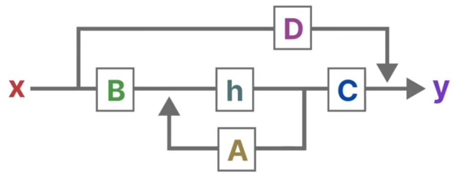

# S4D Vector SoC

Edge AI mini SoC with [PicoRV32](https://github.com/YosysHQ/picorv32) RISC-V CPU and S4D fixed-point accelerator

### Summary
This design enables accelerated inference of an S4D (Diagonal State Space Sequence Model) model. In general, state space models are defined by two equations:

$$
\begin{aligned}
\dot{\mathbf{h}}(t) &= \mathbf{A}\mathbf{h}(t) + \mathbf{B}\mathbf{x}(t) \\
\mathbf{y}(t) &= \mathbf{C}\mathbf{h}(t) + \mathbf{D}\mathbf{x}(t)
\end{aligned}
$$

where $h$ is the state vector, $x$ (or $u$) is the input vector, and $y$ is the output vector. These equations can also be represented in a loop diagram; [this video](https://www.youtube.com/watch?v=BDTVVlUU1Ck) has a pretty good one:

<div align="center">

</div>

A state space sequence model (S4) builds upon this by structuring the state matrix $\mathbf{A}$ (such as using a HiPPO matrix) and discretizing the continuous-time equations for sequence processing. A diagonalized S4 model (S4D) simply uses diagonal state transition (or system) matrices.

This design accelerates models with NxN matrices by loading the weights + state vector into a local BRAM and pipeling through complex arithmetic MAC units over N cycles. This is an implementation recurrent inference for S4D models, more efficient than a convolutional inference.

A sample firmware test suite is provided in ```firmware/```, allowing for cycle comparison of bare-metal simulation versus the accelerator core. The CPU must first write the model weights to the BRAM through MMIO, then invoke a ```custom-0``` RISC-V instruction to compute inference.

### Dependencies
- riscv64-unknown-elf-gcc
- python3
- iverilog
- gtkwave (optional)

[IIC-OSIC-Tools](https://github.com/iic-jku/iic-osic-tools) (listed in ```devcontainer.json```) bundles these tools (except for riscv64).

### Usage
```
> git clone https://github.com/sanrav2016/s4d-vector-soc.git
> cd s4d-vector-soc
> make test-soc     # run firmware
> make wave         # view waveform
> make clean        # delete .tmp dir
```

### References
- https://arxiv.org/abs/2111.00396
- https://arxiv.org/abs/2206.11893
- https://github.com/state-spaces/s4
- https://www.youtube.com/watch?v=BDTVVlUU1Ck
- https://www.youtube.com/watch?v=Qgjawf20v7Y

## Roadmap
- [x] Develop complex MAC
- [X] Write BRAM
- [X] Integrate accelerator with CPU
- [x] Write testbench and C firmware for benchmarking
- [ ] Implement peripherals
- [ ] Synthesize and benchmark